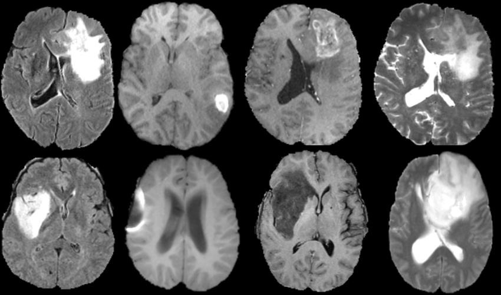

# 🧠 Brain Tumor Classification from MRI Scans using Deep Learning

<p align="center">
  
</p>

<p align="center">
  
  
  
  
  
</p>

This project leverages deep learning to classify brain tumors from MRI images into four categories: **Glioma**, **Meningioma**, **Pituitary**, and **No Tumor**. The goal is to assist early diagnosis and improve clinical decision-making.

---

## 📂 Dataset

The dataset is sourced from [Kaggle](https://www.kaggle.com/datasets/masoudnickparvar/brain-tumor-mri-dataset/data), and it combines multiple open-access datasets:

- Figshare
- SARTAJ (with mislabeled images removed)
- Br35H (for "No Tumor" class)

### Dataset Summary:

- 🖼️ Total Images: **7,023** MRI brain scans
- 🔍 Classes:
  - **Glioma**
  - **Meningioma**
  - **Pituitary**
  - **No Tumor**

During preprocessing, images are resized, and unnecessary black margins are removed to improve model performance.

---

## 🧠 Model Architecture

A custom **Convolutional Neural Network (CNN)** was built and trained using TensorFlow and Keras. Key highlights include:

- Image preprocessing (resizing, cropping, normalization)
- Data augmentation using `ImageDataGenerator`
- Regularization: Dropout and BatchNormalization
- Optimizer: **Adam**
- Loss Function: **Categorical Crossentropy**

### 🧪 Evaluation Results:

- ✅ **Training Accuracy**: 96%
- ✅ **Validation Accuracy**: 89.4%
- ✅ **Test Accuracy**: 93.73%

Visualization of training progress (accuracy & loss) is available in the notebook.

---

## ⚙️ Training Strategy

Several callbacks were used to optimize model training:

- **EarlyStopping**: Prevents overfitting
- **ReduceLROnPlateau**: Dynamically lowers learning rate
- **ModelCheckpoint**: Saves the best model weights

---

## 📦 Model Export

The final trained model is exported into multiple formats for versatile deployment:

- 🧠 **SavedModel** format: `/saved_model`
- 📱 **TensorFlow Lite (.tflite)**: `/tflite`
- 🌐 **TensorFlow.js**: `/tfjs_model`

These formats enable deployment to mobile apps, web apps, and embedded devices.

---

## 📁 Project Structure

```
├── assets/ # Images, charts, etc.
├── saved_model/ # SavedModel format
├── tflite/ # TFLite model files
├── tfjs_model/ # TensorFlow.js files
├── Submission_Akhir_Novrian_Pratama.ipynb # Notebook (full workflow)
├── requirements.txt # Python dependencies
└── README.md # Project documentation
```

---

## 🚀 Getting Started

### 1. Clone this repository

```bash
git clone https://github.com/your-username/brain-tumor-classification.git
cd brain-tumor-classification
```

### 2. Install dependencies

```bash
pip install -r requirements.txt
```

### 3. Run the notebook

Open the notebook Submission_Akhir_Novrian_Pratama.ipynb and execute it step by step:

- Download the dataset (via Kaggle API)
- Preprocess images
- Train the CNN model
- Export the model formats
